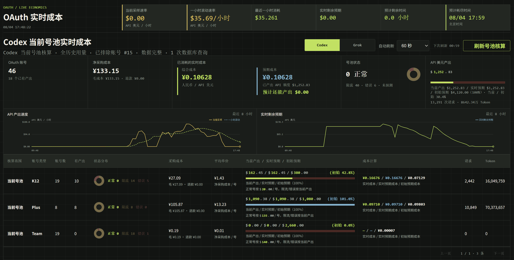
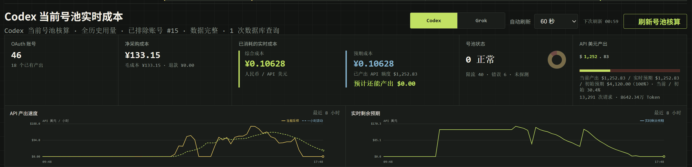
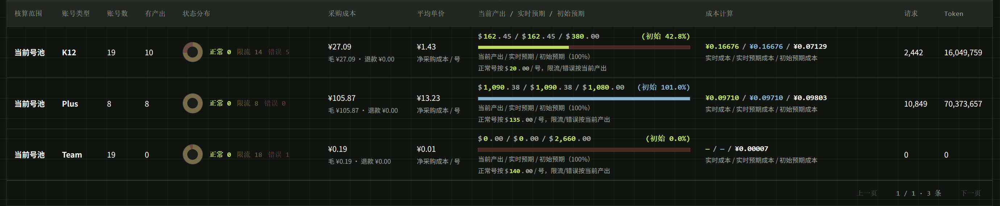
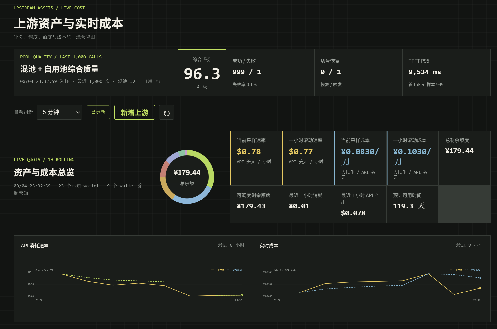
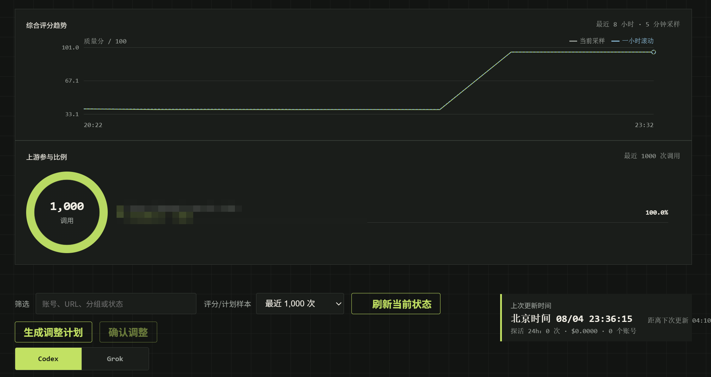
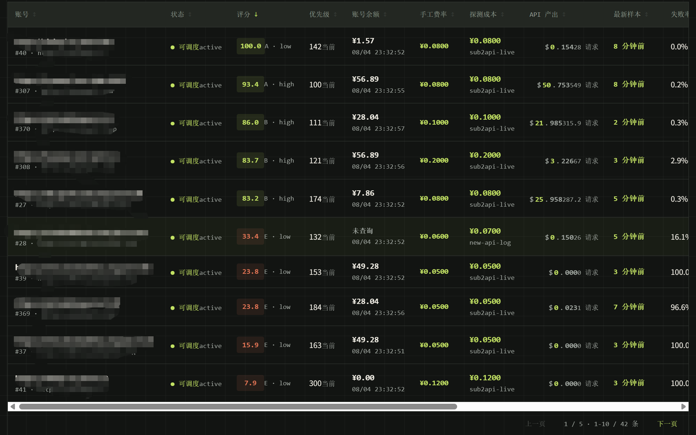
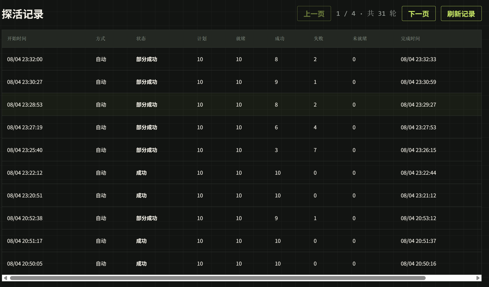
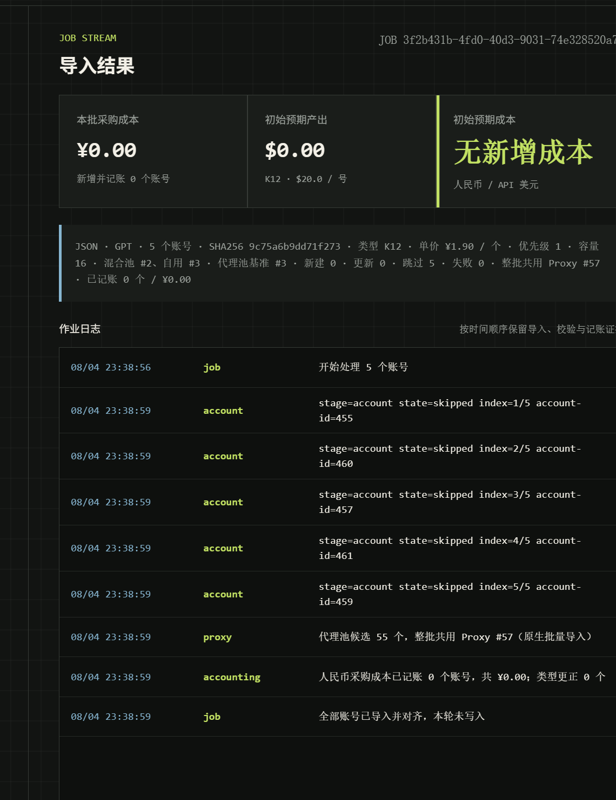
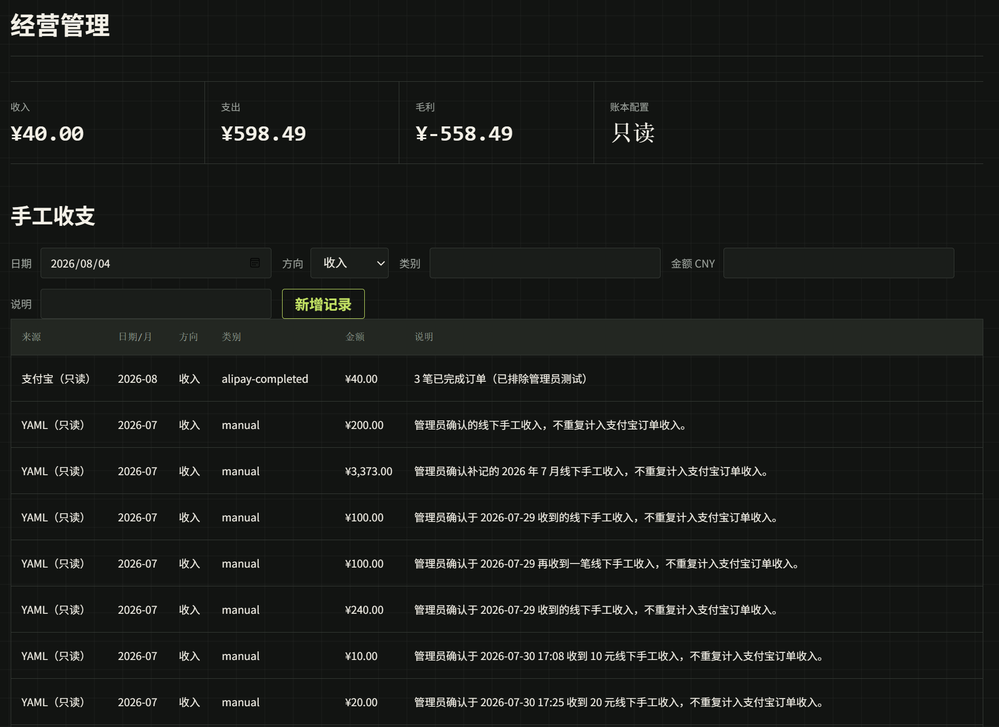

# Api2Business 交流群：2160077056


Api2Business 是面向 Sub2API 运行面的经营分析与调度控制台。它把 OAuth 账号、API-key
上游、用户用量、采购成本、余额资产和请求质量放在同一套可审计的数据口径中，并通过
YAML-first 配置、排队数据库读取和 Temporal 长流程完成日常运维。



## 核心能力

- OAuth 号池核算：
  - 按 Free、K12、Plus、Team 等类型展示采购成本、当前产出和预期产出；
  - 同时计算实时成本、实时预期成本与初始预期成本；
  - 区分正常、限流、错误和未探测状态，避免把死亡账号的未来产出继续计入预期。
- 上游资产与质量：
  - 汇总 API-key 上游余额、消耗速率、滚动成本和预计可用时间；
  - 结合成功率、用户可见失败、切号恢复与 TTFT 计算质量评分；
  - 根据质量、成本、余额和探索权重生成可确认的优先级调整计划。
- 账号运行面管理：
  - 支持 Codex 与 Grok OAuth JSON/ZIP 批量导入；
  - 支持上游创建、充值记账、费率调整、分组和并发配置；
  - 支持账号结算、退款、退役和完整操作日志。
- 经营核算：
  - 汇总收入、采购、退款、待履约和上游剩余资产；
  - 输出每日毛利事实，并对缺失采购成本等数据给出 warning；
  - 经营日报保存在 Git 忽略的本机状态目录中。

## 界面预览

### 实时速率与剩余预期

当前采样速率与一小时滚动速率使用同一坐标轴，便于识别突发流量和持续消耗趋势。



### 分类型成本核算

每种账号类型独立展示状态、采购成本、产出进度和成本口径，不使用没有决策意义的
跨类型总平均单价。



### 上游资产与综合质量

资产、实时成本、综合质量和最近调用参与比例使用同一套持久化采样口径。

| 资产与实时成本 | 质量趋势与参与比例 |
| --- | --- |
|  |  |

### 账号评分与探活

账号总表汇总评分、余额、成本、产出和失败率；探活记录按轮展示计划、成功、失败和耗时。

| 上游账号评分与排序 | 自动探活记录 |
| --- | --- |
|  |  |

### 导入作业与经营台账

批量导入保留校验和记账证据，经营页统一汇总自动收入、手工收支和毛利事实。

| 账号导入作业结果 | 经营管理与收支账本 |
| --- | --- |
|  |  |

## 架构

```text
浏览器 / CLI
      |
Api2Business API
      |-------------------- PostgreSQL 持久化缓存与经营账本
      |
Temporal Worker ---------- 长流程、周期采样与运行面变更
      |
Sub2API Admin API -------- 批量导入、账号和上游管理
      |
Sub2API PostgreSQL ------- 排队单连接只读查询
```

- API 请求负责快速校验、提交任务和读取持久化投影；
- Worker 承担导入、采样、探活和优先级调整等长流程；
- 对 Sub2API 数据库的读取统一排队，运行面 API 调用可按任务边界并发；
- 页面优先展示 PostgreSQL 中的最近缓存，再异步刷新实时结果。

## 快速开始

需要 Bun、PostgreSQL、Temporal，以及一个可访问的 Sub2API 管理面。

```bash
bun install
cp config/api2business.example.yaml config/api2business.yaml
bun scripts/api2business-cli.ts \
  --config config/api2business.yaml \
  config validate
bun scripts/api2business-cli.ts \
  --config config/api2business.yaml \
  native start --component all
bun scripts/api2business-cli.ts \
  --config config/api2business.yaml \
  native status --component all --json
```

停止全部本机组件：

```bash
bun scripts/api2business-cli.ts \
  --config config/api2business.yaml \
  native stop --component all
```

## 配置与凭据

提交到 Git 的配置模板位于 `config/api2business.example.yaml`。首次使用时复制为
`config/api2business.yaml`，再填写运行目标、公开入口和 Secret 引用；本机配置已被
Git 忽略。

Secret 值不得写入 YAML。管理员账号、数据库连接和其他凭据通过 `sourceRef` 指向
仓库外、仅 owner 可读的文件。建议权限如下：

```bash
chmod 700 /path/to/secrets
chmod 600 /path/to/secrets/*.env
```

生产账本、采样缓存和每日经营分析同样应放在 Git 忽略的状态目录中。公开 issue、日志
和截图不得包含 API key、访问令牌、用户邮箱、供应商 URL 或真实数据库地址。

## 部署

部署统一先克隆本仓库，再加载仓内
[`skills/api2business/SKILL.md`](skills/api2business/SKILL.md) 选择并执行部署方式。
部署不绑定特定平台；仓库提供容器镜像、Compose 配置和 Kubernetes 基础模板，其他
运行环境也可以复用同一镜像与配置合同。稳定部署合同见
[部署参考](docs/reference/deployment.md)，自动化代理入口见
上述 skill。

```bash
bun run deploy:validate
```

## 开发检查

```bash
bun run check
bun test
```

项目当前仍处于快速迭代阶段。生产部署前应根据实际 Sub2API 版本校对管理 API、数据库
字段和 failover 规则，并使用最小权限的独立凭据。

## 许可协议

本项目采用 [MIT License](LICENSE)。
